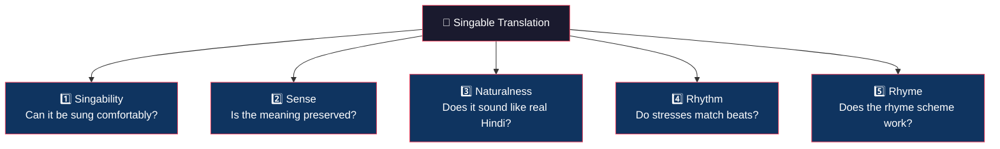

# Research Foundations: From Brain Science to Architecture

> *"If I were doing this research, I would ground every architectural choice in how the brain actually processes singing and how professionals actually translate songs."*

---

## Part 1: How the Brain Processes Lyrics + Melody

### 1.1 The SSIRH — Music and Language Share Integration Resources

The most influential theory here is **Patel's Shared Syntactic Integration Resource Hypothesis (SSIRH)** [1, 2]:

- Music and language have **separate representations** (stored in different brain networks)
- But they share **integration resources** in frontal brain regions (especially Broca's area)
- This means: the brain uses **one shared "glue" mechanism** to bind both linguistic structure and musical structure into coherent sequences

**What this means for your architecture:**
Your current design has a **shared encoder** (mBART) + **separate melody encoder** + **fusion layer**. This is actually well-aligned with SSIRH! The fusion layer acts as the "shared integration resource." But the key insight you're missing is:

> [!IMPORTANT]
> The brain doesn't just "fuse" lyrics and melody — it **integrates them hierarchically**, at multiple structural levels simultaneously (syllable ↔ note, phrase ↔ musical phrase, verse ↔ section)

### 1.2 Hierarchical Processing — GTTM

Lerdahl & Jackendoff's *Generative Theory of Tonal Music* (GTTM) [3] describes music cognition through **four hierarchical structures**:

| GTTM Structure | Musical Level | Lyric Equivalent | Your Model's Coverage |
|---|---|---|---|
| **Grouping** | Motifs → Phrases → Sections | Words → Lines → Verses | ❌ You only model note-level |
| **Metrical** | Strong/weak beat hierarchy | Stressed/unstressed syllables | ⚠️ `beat_strength` feature exists but isn't used hierarchically |
| **Time-span reduction** | Rhythmic stability hierarchy | Syllable timing/duration | ❌ Not modeled |
| **Prolongational reduction** | Tension/relaxation patterns | Emotional arc of lyrics | ❌ Not modeled |

**Key insight:** Your current architecture operates at a **flat, note-level** — every note is treated equally. The brain processes music **hierarchically**: some notes are structurally more important than others. A phrase-level representation is critical.

### 1.3 Dual-Pathway Model

Brain imaging research shows two pathways for processing sung language [4, 5]:

```
                    ┌─────────────────────────────────┐
                    │         SUNG LANGUAGE            │
                    └──────────┬──────────────────────┘
                               │
              ┌────────────────┴────────────────┐
              ▼                                 ▼
   ┌──────────────────┐              ┌──────────────────┐
   │  VENTRAL PATHWAY  │              │  DORSAL PATHWAY   │
   │  ("What")         │              │  ("How")           │
   │                   │              │                   │
   │  • Semantic       │              │  • Motor planning  │
   │    meaning        │              │  • Rhythm timing   │
   │  • Word identity  │              │  • Pitch matching  │
   │  • Melody         │              │  • Syllable-note   │
   │    recognition    │              │    coordination    │
   │                   │              │                   │
   │  Left temporal    │              │  Bilateral         │
   │  cortex           │              │  frontoparietal    │
   └──────────────────┘              └──────────────────┘
```

**What this means:** Your model needs two "streams":
- **Ventral** (semantic): The mBART translation backbone handles this ✅
- **Dorsal** (motor/rhythmic): This is **entirely missing** ❌ — you need a component that models the motor constraints of *singing* the output (syllable timing, breath points, stress alignment)

### 1.4 The STS Binding Discovery

A fascinating 2010 study by Sammler et al. [6] found that in the superior temporal sulcus (STS):
1. **Early processing**: Brain treats the song as a **single integrated signal**
2. **Mid processing**: Words are **separated from music** for semantic extraction
3. **Late processing**: Brain **re-integrates** lyrics with melody for unified comprehension

This suggests a **encode → separate → re-integrate** pipeline — which is remarkably similar to your `mBART encoder → separate melody encoder → fusion` design. The difference is that the brain does this iteratively, not in a single pass.

---

## Part 2: How Professional Song Translators Work

### 2.1 Low's Pentathlon Principle

Peter Low [7, 8] studied how expert song translators actually work and identified **five competing constraints** they balance simultaneously:



**Mapping to loss functions:**

| Pentathlon Criterion | Your Current Loss | What You Should Have |
|---|---|---|
| **Singability** (syllable fit) | ⚠️ Weak proxy (`token count`) | Actual syllable count predictor |
| **Sense** (meaning) | ✅ Cross-entropy translation loss | ✅ + add BERTScore |
| **Naturalness** (fluency) | ❌ Not modeled | Language model perplexity score |
| **Rhythm** (stress ↔ beat) | ❌ Placeholder | Stress-beat alignment loss |
| **Rhyme** | ❌ Not modeled | Phonetic ending similarity loss |

> [!IMPORTANT]
> Low emphasizes that **no single criterion is sacrosanct** — translators make pragmatic tradeoffs. Your multi-objective loss should have **learnable weights** that the model adjusts, not fixed α/β/γ/δ values.

### 2.2 The Translation Process (How Artists Actually Do It)

Based on translation studies literature [7, 8, 9], professional song translators follow this process:

1. **Analyze the melody structure** → Identify phrase boundaries, strong beats, breath points
2. **Count syllables per musical phrase** → Not per note, but per phrase
3. **Identify stressed beats** → Which syllables MUST fall on strong beats
4. **Draft semantic translation** → Get the meaning roughly right
5. **Adapt for syllable count** → Compress/expand to match phrase length
6. **Adjust for stress alignment** → Ensure important words land on strong beats
7. **Polish for naturalness** → Make it sound like real language, not "translated"
8. **Check singability** → Actually sing it to verify comfort

This is an **iterative, multi-pass refinement** process — not a single left-to-right generation pass like your current decoder does.

---

## Part 3: What This All Means for Your Architecture

### 3.1 Your Current Architecture vs. What the Science Suggests

```
YOUR CURRENT ARCHITECTURE:
┌──────────┐    ┌───────────┐    ┌────────┐    ┌──────────┐
│ English  │───▶│   mBART   │───▶│ Fusion │───▶│  mBART   │──▶ Hindi
│  Text    │    │  Encoder  │    │        │    │ Decoder  │
└──────────┘    └───────────┘    │        │    └──────────┘
                                 │        │
┌──────────┐    ┌───────────┐    │        │
│  MIDI    │───▶│  CNN+GRU  │───▶│        │
│  Notes   │    │  Encoder  │    └────────┘
└──────────┘    └───────────┘
```

**Problem:** This is a single-pass, flat architecture. The brain (and professional translators) work **hierarchically** and **iteratively**.

### 3.2 Proposed Redesign — Cognitively-Grounded Architecture

```
PROPOSED ARCHITECTURE (Grounded in Cognitive Science):

┌──────────────────────────────────────────────────────┐
│  HIERARCHICAL MELODY ENCODER (from GTTM §1.2)       │
│                                                      │
│  Note-level ──▶ Phrase-level ──▶ Section-level       │
│  (CNN+GRU)      (Attention)      (Pooling)           │
│                                                      │
│  Features: pitch, duration, IOI, beat_strength,      │
│            phrase_boundary, stress_pattern            │
└──────────────┬───────────────────────────────────────┘
               │
               │  phrase-level melody representations
               ▼
┌──────────────────────────────────────────────────────┐
│  STAGE 1: SEMANTIC TRANSLATION (Ventral path §1.3)   │
│                                                      │
│  mBART Encoder ──▶ mBART Decoder ──▶ Draft Hindi     │
│  (frozen)          (partially trainable)              │
│                                                      │
│  Loss: Cross-entropy + BERTScore (Sense+Naturalness) │
└──────────────┬───────────────────────────────────────┘
               │
               │  draft translation
               ▼
┌──────────────────────────────────────────────────────┐
│  STAGE 2: MUSICAL ADAPTATION (Dorsal path §1.3)      │
│                                                      │
│  Refine draft to fit melody constraints:             │
│  • Syllable count adjustment per phrase              │
│  • Stress-beat alignment                             │
│  • Rhyme scheme matching                             │
│                                                      │
│  Architecture: Edit-based model (like REFFLY)        │
│  OR: Re-ranking with constrained beam search         │
│                                                      │
│  Loss: Syllable + Rhythm + Rhyme (from Low §2.1)     │
└──────────────────────────────────────────────────────┘
```

> [!TIP]
> This two-stage approach mirrors both the brain's "encode → separate → re-integrate" process (§1.4) and the professional translator's workflow (§2.2). Stage 1 = "draft semantic translation", Stage 2 = "adapt for singability."

---

## Part 4: Concrete Implementation Changes

### 4.1 Priority 1 — Hierarchical Melody Encoder

Replace your flat note-level encoder with a hierarchical one:

```python
class HierarchicalMelodyEncoder(nn.Module):
    """
    Encodes melody at three levels (inspired by GTTM):
    1. Note-level: local patterns (existing CNN+GRU)
    2. Phrase-level: musical phrases (new)
    3. Section-level: verse/chorus structure (new)
    """
    def __init__(self, ...):
        # Level 1: Note encoder (your existing CNN+GRU)
        self.note_encoder = MelodyEncoder(...)  # existing
        
        # Level 2: Phrase encoder
        # Groups notes into phrases, then encodes each phrase
        self.phrase_attention = nn.MultiheadAttention(...)
        self.phrase_boundary_detector = nn.Linear(hidden, 1)  # sigmoid
        
        # Level 3: Section encoder
        self.section_pool = nn.AdaptiveAvgPool1d(4)  # 4 sections per song
    
    def forward(self, melody_features):
        # Level 1: Note-level encoding
        note_encoded = self.note_encoder(melody_features)
        
        # Level 2: Detect phrase boundaries, then encode phrases
        boundaries = torch.sigmoid(self.phrase_boundary_detector(note_encoded))
        phrase_encoded = self.phrase_attention(note_encoded, note_encoded, note_encoded)
        
        # Level 3: Section-level pooling
        section_encoded = self.section_pool(phrase_encoded.transpose(1,2)).transpose(1,2)
        
        return note_encoded, phrase_encoded, section_encoded
```

### 4.2 Priority 2 — Multi-Level Fusion

Fuse at **both** note-level and phrase-level:

```python
class HierarchicalFusion(nn.Module):
    def __init__(self, text_dim, melody_dim):
        self.word_note_attention = nn.MultiheadAttention(...)   # word ↔ note
        self.phrase_phrase_attention = nn.MultiheadAttention(...)  # text-phrase ↔ melody-phrase
    
    def forward(self, text_features, note_features, phrase_features):
        # Fine-grained: each word attends to notes (your current approach)
        word_fused, word_attn = self.word_note_attention(
            query=text_features, key=note_features, value=note_features)
        
        # Coarse-grained: each text phrase attends to melody phrases
        phrase_fused, phrase_attn = self.phrase_phrase_attention(
            query=text_features, key=phrase_features, value=phrase_features)
        
        # Combine both levels
        return word_fused + phrase_fused, (word_attn, phrase_attn)
```

### 4.3 Priority 3 — Pentathlon Loss Function

Implement all five of Low's criteria as differentiable losses:

```python
class PentathlonLoss(nn.Module):
    """
    Five-objective loss based on Low's Pentathlon Principle.
    Weights are LEARNABLE, not fixed — the model learns
    which tradeoffs to make (just like a human translator).
    """
    def __init__(self):
        super().__init__()
        # Learnable log-weights (uncertainty weighting from Kendall et al. 2018)
        self.log_vars = nn.Parameter(torch.zeros(5))
    
    def forward(self, translation_loss, syllable_loss, rhythm_loss, 
                naturalness_loss, rhyme_loss):
        losses = [translation_loss, syllable_loss, rhythm_loss, 
                  naturalness_loss, rhyme_loss]
        
        total = sum(
            torch.exp(-self.log_vars[i]) * loss + self.log_vars[i]
            for i, loss in enumerate(losses)
        )
        return total
```

---

## Part 5: Key References (Bibliography)

### Cognitive Neuroscience

| # | Reference | Key Contribution |
|---|---|---|
| [1] | Patel, A.D. (2003). "Language, music, syntax and the brain." *Nature Neuroscience* 6(7). | SSIRH — shared integration resources |
| [2] | Patel, A.D. (2008). *Music, Language, and the Brain.* Oxford University Press. | Comprehensive book on music-language cognition |
| [3] | Lerdahl, F. & Jackendoff, R. (1983). *A Generative Theory of Tonal Music.* MIT Press. | Hierarchical music structure (GTTM) |
| [4] | Hickok, G. & Poeppel, D. (2007). "The cortical organization of speech processing." *Nature Reviews Neuroscience* 8(5). | Dual-pathway model for auditory processing |
| [5] | Loui, P. (2015). "A dual-stream neuroanatomy of singing." *Music Perception* 32(3). | Dual dorsal/ventral pathways for singing |
| [6] | Sammler, D. et al. (2010). "Music and language in the superior temporal sulcus." *NeuroImage* 51(2). | STS: encode → separate → re-integrate |

### Song Translation Theory

| # | Reference | Key Contribution |
|---|---|---|
| [7] | Low, P. (2005). "The Pentathlon Approach to Translating Songs." *Song and Significance.* | Five criteria: singability, sense, naturalness, rhythm, rhyme |
| [8] | Low, P. (2017). *Translating Song: Lyrics and Texts.* Routledge. | Comprehensive book on singable translation |
| [9] | Franzon, J. (2008). "Choices in song translation." *The Translator* 14(2). | Taxonomy of translation strategies for songs |

### Neural Models for Song Translation

| # | Reference | Key Contribution |
|---|---|---|
| [10] | Guo et al. (2023). "Lyrics-Melody Translation with Adaptive Grouping." *ACL 2023.* | LTAG — adaptive note grouping, closest to your work |
| [11] | Guo et al. (2022). "GagaST: Automatic Song Translation." *ACL 2022.* | Constrained decoding for tonal languages |
| [12] | Sheng et al. (2021). "SongMASS." *AAAI 2021.* | MASS pretraining for lyric-melody generation |
| [13] | Li et al. (2024). "REFFLY: Melody-Constrained Lyrics Editing." *ACL 2024.* | Edit-based approach (Stage 2 inspiration) |
| [14] | Lee et al. (2023). "Singable lyric translation as constrained NMT." *ACL 2023.* | Prompt-driven NMT with rhythm/rhyme constraints |
| [15] | Kendall, A. et al. (2018). "Multi-Task Learning Using Uncertainty." *CVPR.* | Learnable loss weights (homoscedastic uncertainty) |

---

## Part 6: Honest Assessment — Would I Use This Architecture?

**For a course project or prototype:** Yes, your current architecture is fine. It demonstrates the key concepts and produces results.

**For publishable research:** I would redesign around three key insights:

1. **Two-stage pipeline** (translate first, then adapt) — because that's how humans do it, and single-pass generation can't easily balance all five Pentathlon constraints
2. **Hierarchical melody representation** — because flat note sequences lose the critical phrase structure that determines where syllable boundaries should fall
3. **Constrained decoding** — because the model cannot enforce musical constraints during training alone; inference-time constraints (LYRA, GagaST) are essential for singability

The good news: your existing components (CNN+GRU encoder, cross-modal fusion, mBART backbone) are all **reusable building blocks** in the redesigned architecture. You don't need to start over — you need to **add hierarchy and constrained decoding** on top of what you have.
